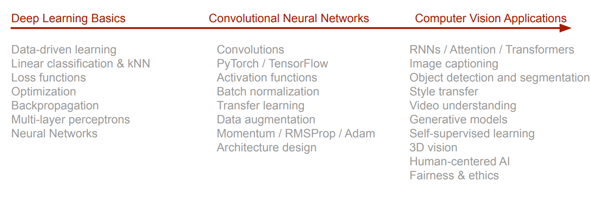

# 课程介绍

## 计算机视觉的历史

计算机视觉的发展，可以分为以下几个阶段

- 视觉表征（1970s）
- 通过边缘检测进行识别（1980s）
- 认知和神经科学逐步发展，视觉技术开始应用（人脸识别，物体检测...）（1995）
- 人类开始更深入地训练神经网络，深度学习技术逐渐成熟（2000s)
- CNN(LeCun)，ImageNet，AlexNet...
- 深度学习用于计算机视觉的各个应用领域（2012至今）

## 课程总览

<figure markdown>
{width=""}
<figcaption>Syllabus</figcaption>
</figure>

## 预修要求

- 精通 Python 和 NumPy
- 微积分，线性代数，概率论等数学知识
- 机器学习基础
