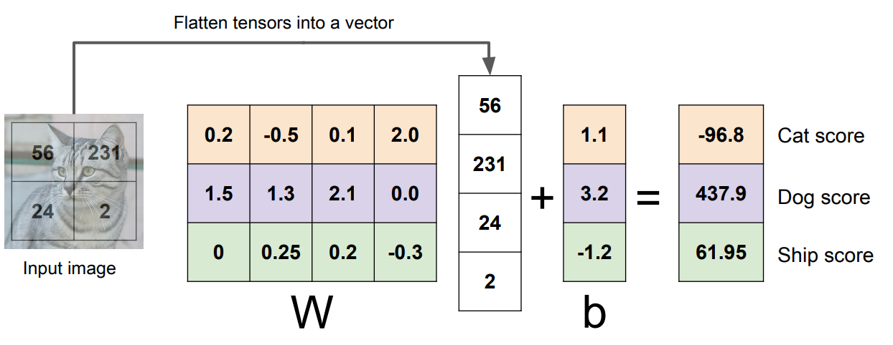
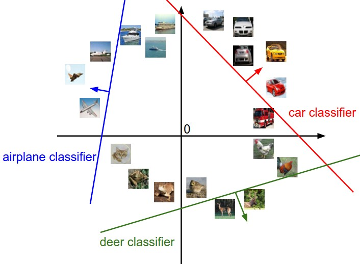

# 图像分类和线性分类器

## 图像分类任务

在图像分类任务中，我们通常会训练一系列的图片和类别，然后在测试集中预测未出现过的图片的类别

### 图像分类器

```python
def classify_image(image):
	# Some magic here?
	return class_label
```

没有显式的算法可以解决这个问题

## 数据驱动的方法

- 收集一系列具有图片和类别的**数据集**
- 使用机器学习的算法训练一个**分类器**
- 在新的测试图片中使用训练好的分类器**预测**类别

### 最近邻

**距离的度量方式：**

L1 (Manhattan) 距离

$$
d_1(I_1, I_2) = \sum_p | I_1^p - I_2^p |
$$

#### 算法

```python
For each test image
  Find closest train image
  Predict label of nearest image
```

<figure markdown>
  { width="400" }
  <figcaption>最近邻示意图</figcaption>
</figure>

### K-最近邻

挑选最相近的K个样本，进行**投票决策**，从而预测新的类别

**另一种距离的度量方式：**

L2 (Euclidean) 距离

$$
d_2(I_1, I_2) = \sqrt{\sum_p (I_1^p - I_2^p)^2}
$$

<figure markdown>
  { width="600" }
  <figcaption>K最近邻示意图</figcaption>
</figure>

!!! note "Note"
    根据上面的图片我们可以发现，不同的 K值的分类结果中，决策边界有很大的不同，一般来说，K值越大，边界越平滑

#### 超参数

- 最佳的**参数 K**应该是什么
- 最佳的**距离度量方式(L1, L2...)**应该是什么

K-最近邻算法基本不用于图像分类任务

- 距离难以描述，像素表示的信息量太少
- 维度灾难，计算复杂

### 线性分类器

#### 模型

$$
f(x, W) = Wx + b
$$

- $x$ 的大小是 $3072 \times 1$，将输入的图片($32 \times 32 \times 3$) 展平为向量
- $W$ 的大小是 $10 \times 3072$，代表权重或参数，其中 $10$ 是类别总数
- $f$ 的大小是 $10 \times 1$，代表各个类别最后的得分
- $b$ 是偏差，用于调整分类器的参数

下图是一个计算的例子：

<figure markdown>
  { width="600" }
</figure>

---

#### 几何角度理解

<figure markdown>
  { width="400" }
</figure>

!!! note "Note"
    在上图的平面坐标系中，每张图像（高维中的对象）都是一个**坐标点**，分类器训练出来的权值形成了这些**分界线**，沿着分界线箭头所示方向的图像得分逐渐提高，说明分类结果是正确的，而相反方向的图像得分逐渐降低，说明分类结果错误，这张图也说明了线性分类模型具有局限性，在描述信息的能力上存在很大的不足

---

#### 多类别 SVM

**支持向量机(Support Vector Machine, SVM)**是一类按监督学习方式对数据进行分类的线性分类器

损失函数可以帮助我们评估当前分类器的表现如何，量化当前的偏差到底有多少，从而帮助我们挑选更优的权重参数

SVM 的损失函数叫做**合页损失(Hinge Loss)**

$$
\begin{aligned}
L_i & =\sum_{j \neq y_i} \begin{cases}0 & \text { if } s_{y_i} \geq s_j+1 \\
s_j-s_{y_i}+1 & \text { otherwise }\end{cases} \\
& =\sum_{j \neq y_i} \max \left(0, s_j-s_{y_i}+1\right) \\
L &= \frac{1}{N} \sum_{i=1}^N L_i
\end{aligned}
$$

> 上式中的 $s_{y_{i}}$ 代表的是正确的类别对应的分数，$s_j$ 代表的是其他类别对应的分数

!!! tip "Tip"
    事实上 $s_j - s_{y_i} +1$ 中的 $1$ 也可以理解为是一个超参数，我们关心的是各个类别得分的相对差值，所以这个 $1$ 可以根据实际情况来调整，由于 SVM Loss 是一个很常用的损失函数，一般我们就用默认参数

**一个计算 SVM Loss 的例子：**

假设现在我们有三个类别$(cat/car/frog)$和三张图片$(img_1/img_2/img_3)$，它们的得分如下：

<div style="text-align: center" markdown="1">

| | $img_1(cat)$ | $img_2(car)$ | $img_3(frog)$ |
| :---: | :--- | :--- | :--- |
| $cat$ | **3.2** | 1.3 | 2.2 |
| $car$ | 5.1 | **4.9** | 2.5 |
| $frog$ | -1.7 | 2.0 | **-3.1** |

</div>

现在计算 $img_1$ 的损失值，它的真实类别是 $cat$，对应 $y_i$

$$
\begin{aligned}
L_1 &= max(0, 5.1-3.2+1) + max(0, -1.7-3.2+1) \\
&= max(0, 2.9) + max(0, -3.9) \\
&= 2.9
\end{aligned}
$$

同理，我们可以计算 $img_2$ 和 $img_3$ 的损失值分别为 $L_2 =0, L_3 = 12.9$

最后的总损失值

$$
L = \frac{2.9+0+12.9}{3} = 5.27
$$

---

#### Softmax 分类器

将各个类别的原始得分转化为**概率**

$$
\begin{aligned}
& s = f\left(x_i ; W\right) \\
& P\left(Y=k \mid X=x_i\right) = \frac{e^{s_k}}{\sum_j e^{s_j}}
\end{aligned}
$$

> 最后各个类别的概率相加要等于 1

Softmax 的损失函数叫做**交叉熵损失(Cross Entropy Loss)**

$$
\begin{aligned}
L_i &= -\log \left(\frac{e^{s_{y_i}}}{\sum_j e^{s_j}}\right) \\
L &= \frac{1}{N} \sum_{i=1}^N L_i
\end{aligned}
$$

> 这里对数是**自然对数$(e)$**，而不是以 $2$ 或 $10$ 为底的对数

**一个计算 Softmax Loss 的例子：**

还是和之前一样，假设现在我们有三个类别和三张图片，它们的得分如下：

<div style="text-align: center" markdown="1">

| | $img_1(cat)$ | $img_2(car)$ | $img_3(frog)$ |
| :---: | :--- | :--- | :--- |
| $cat$ | **3.2** | 1.3 | 2.2 |
| $car$ | 5.1 | **4.9** | 2.5 |
| $frog$ | -1.7 | 2.0 | **-3.1** |

</div>

以 $img_1$ 为例，先对每一个得分取 $e$ 的指数，得到 $[24.5, 164.0, 0.18]$

再根据 softmax 算子计算得到概率 $[0.13, 0.87, 0.00]$

现在计算 $img_1$ 的损失，它的真实类别是 $cat$，对应 $y_i$

$$
\begin{aligned}
L_1 &= -log P(Y=y_i | X = x_i) \\
&= -log(0.13) \\
&= 2.04
\end{aligned}
$$

同理，我们可以计算 $img_2$ 和 $img_3$ 的损失值并取平均值得到最后的损失值

--- 

#### 对比 SVM 和 Softmax

下面这张图有助于帮我们认识 SVM 和 Softmax 分类器之间的区别

<figure markdown>
{width="600"}
<figcaption></figcaption>
</figure>

!!! note "Note"
    在上图中，我们分别计算了同一个**分数向量(score vector) $f$** 的 SVM Loss 和 Softmax Loss<br>
    不同之处在于这两个分类器对于 $f$ 中的分数的解释

    - SVM 分类器将分数解释为**类别得分**，因此它鼓励正确类别最后的得分高，那么在计算损失函数的时候，我们的计算方式是 $max(0, s_j - s_{y_i} + 1)$，当 $s_{y_i}$ 相对较大的时候，这个值一直是0，所以对于损失值的贡献很少<br>
        SVM 分类器更容易满足一些，一定程度上它只需要关注**内部的相对得分**即可，不太在意损失值的绝对大小，比如假设 $f = [10, -100, -100] \quad \text{or} \quad f = [10, 9, 9]$，则第一类对应的 SVM Loss 都为0，但从得分可以说明第一类是分类正确的
    - Softmax 分类器将分数解释为每个类的**（非标准化的）对数概率**，因此它鼓励正确类别的对数概率为高，在计算损失函数的时候，我们的计算方式是 $-log P(Y=y_i | X = x_i)$，概率越高对应的损失值越小<br>
        Softmax 分类器无法判断正确的类别是什么，它只能给出各个类别的概率，可以理解为**置信度**
    - 使用不同分类器计算得到的损失值是不可比较的，这样的比较没有意义（标准不同），损失函数是一个**内部量化的标准**

> 课程提供了一个可以在网页交互的 Demo，帮助我们理解线性分类器：[Interactive web demo](http://vision.stanford.edu/teaching/cs231n-demos/linear-classify/)
