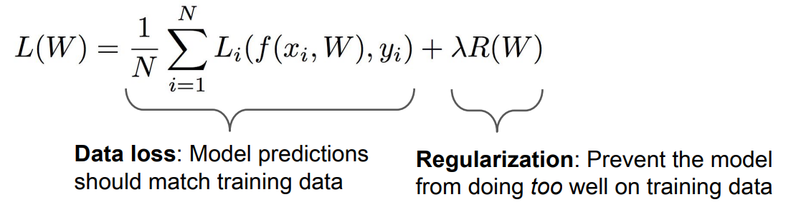

# 正则化和优化

## 正则化

**为什么要正则化**

- 防止模型太复杂，在训练集上表现得太好
- 避免拟合噪声，利于训练权重
- 添加非线性正则项，提高模型泛化性能

<figure markdown>
{width="500"}
<figcaption></figcaption>
</figure>

- $\lambda$ 是一个超参数，代表**正则强度(regularization strength)**
  > 一般使用 L2 正则时我们用 $\lambda$ 表示，而使用 L1 正则时我们用 $\alpha$ 表示
- 正则函数
	- L2 正则：$R(W)=\sum_k \sum_l W_{k, l}^2$
		- L2 正则可以使得参数平滑，防止模型过拟合
	- L1 正则：$R(W)=\sum_k \sum_l | W_{k, l} |$
		- L1 正则可以使得参数稀疏化
		- L1 正则对于样本的坐标系有依赖
- 其他更复杂的防止过拟合方法
	- Dropout
	- Batch Normalization(BN)
	- Fractional Pooling

## 优化

### 随机梯度下降(SGD)

在多元函数中，每一个变量的梯度是多元函数对该变量的偏导数组成的向量

以一元为例：

$$
\frac{d f(x)}{d x}=\lim _{h \rightarrow 0} \frac{f(x+h)-f(x)}{h}
$$

!!! example "Example"
    假设现在的权重：$W = [0.34, -1.11, 0.78, 0.12, ...]$

    计算得到一个损失值 $l_1 = 1.25347$

    取 $h = 0.0001$，则更新后的权重：

    $$W' = W + h = [0.34 + \boldsymbol{0.0001}, -1.11 + \boldsymbol{0.0001}...]$$

    计算得到一个损失值 $l_2 = 1.25322$

    根据公式 $(l_2 - l_1)/h$，计算 $W$ 的梯度：$dW = [-2.5, 0.6, ...]$

这种计算参数梯度的方法很低效，因此我们考虑可以计算梯度的**解析解**

$$
\begin{aligned}
& L=\frac{1}{N} \sum_{i=1}^N L_i+\sum_k W_k^2 \\
& L_i=\sum_{j \neq y_i} \max \left(0, s_j-s_{y_i}+1\right) \\
& s=f(x ; W)=W x \\
\\
& \text{calculate} \quad \nabla_W L
\end{aligned}
$$

**梯度检查**：计算出梯度的解析解之后，代入数值进行检验

当参数的规模很大的时候，每次都计算所有参数的梯度开销很大，因此我们进行批量化，每次计算梯度的时候只选取一个 *minibatch* 进行计算

$$
\begin{aligned}
\nabla_W L(W)=\frac{1}{K} \sum_{i \in \sum_K} \nabla_W L_i\left(x_i, y_i, W\right)+\lambda \nabla_W R(W)
\end{aligned}
$$

!!! question "Question"
    关于 SGD 存在的一些问题

    - Q1: 如果损失值在一个梯度方向变化得很快而在另一个方向变化得很缓慢会怎么样
    - A1: 
