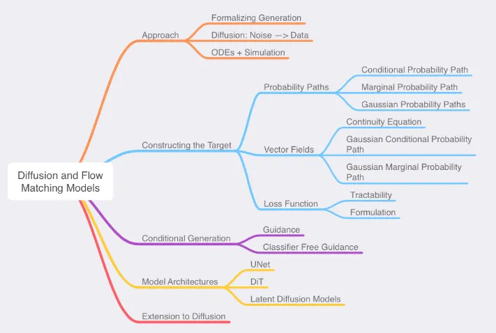

# MIT 6.S184: Introduction to Flow Matching and Diffusion Models

!!! abstract "Abstract"
    - Website: [:fontawesome-solid-house: Latest version](https://diffusion.csail.mit.edu/)
    - Labs: [:fontawesome-brands-github: Zicx's repo (2025 Spring)](https://github.com/cxzhou35/mit6s184)
    > Learning Process:
    >
    > 1) Watch the lecture videos, take notes based on the slides.
    >
    > 2) Complete the lab assignments (notebooks) for the corresponding lecture.
    >
    > 3) Refine the notes based on the lecture notes.

## Table of Contents

### Lecture Notes

- [x] [Lecture 1: Flow and Diffusion Models](./lec01.md)
- [x] [Lecture 2: Constructing a Training Target](./lec02.md)
- [x] [Lecture 3: Training Flow and Diffusion Models](./lec03.md)
- [x] [Lecture 4: Building an Image Generator](./lec04.md)

### Labs

- [x] [Lab1: Working with SDEs](https://github.com/cxzhou35/mit6s184/blob/main/labs/lab_one.ipynb)
- [x] [Lab2: Flow Matching and Score Matching](https://github.com/cxzhou35/mit6s184/blob/main/labs/lab_two.ipynb)
- [x] [Lab3: Conditional Image Generation](https://github.com/cxzhou35/mit6s184/blob/main/labs/lab_three.ipynb)

## Recap
<figure markdown="span">
    { width=80% align="center" }
    <figcaption>Credit: [Flow Matching and Diffusion Deep Dive @Medium](https://medium.com/@hasfuraa/flow-matching-and-diffusion-deep-dive-b080f7782654)</figcaption>
</figure>
