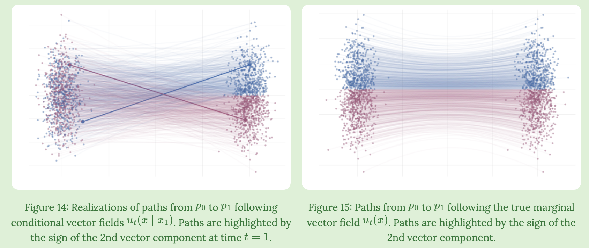
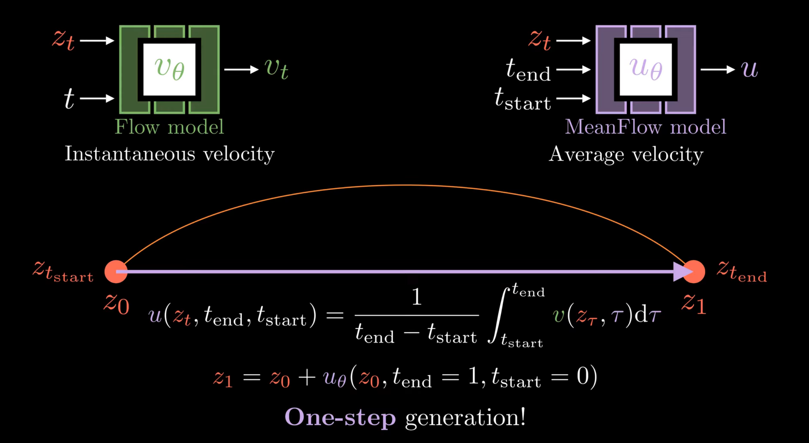
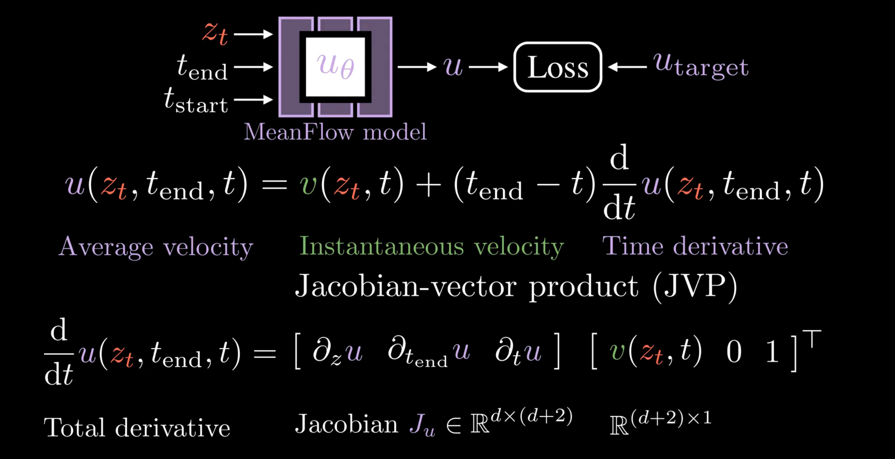
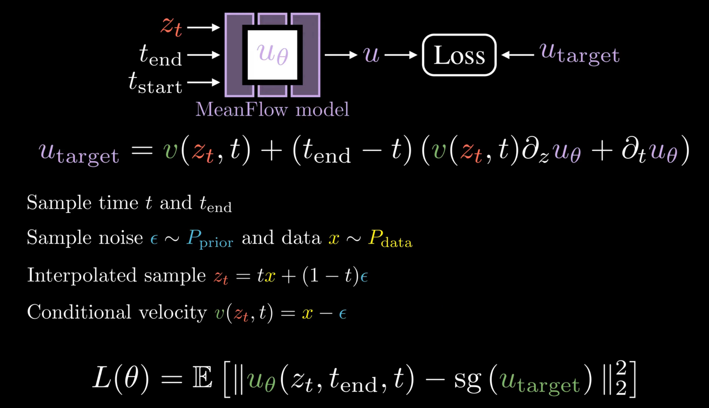
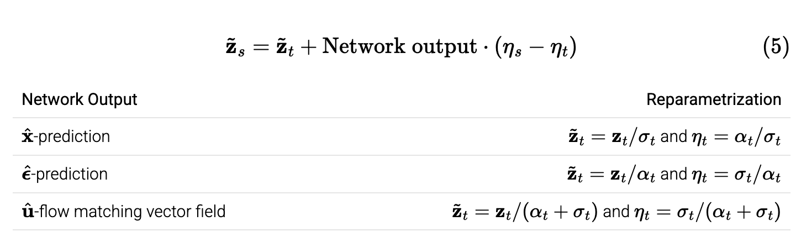

# MIT 6.S184: Introduction to Flow Matching and Diffusion Models

!!! abstract "Abstract"
    :octicons-star-16: **[Latest updates](#updates) related to this course can be found at the bottom of this page.**

    - Website: [:fontawesome-solid-house: Latest version](https://diffusion.csail.mit.edu/)
    - Labs: [:fontawesome-brands-github: Zicx's repo (2025 Spring)](https://github.com/cxzhou35/mit6s184)
    > My learning steps:
    >
    > 1. Review lecture videos and capture key insights from the slides.
    > 2. Apply theoretical concepts by completing the corresponding lab assignments.
    > 3. Consolidate learning by refining personal notes against the provided lecture notes.

## Table of Contents

- [Table of Contents](#table-of-contents)
    - [Lecture Notes](#lecture-notes)
    - [Labs](#labs)
    - [Course Recap](#recap)
    - [Resources](#resources)
- [Updates](#updates)

### Lecture Notes

- [x] [Lecture 1: Flow and Diffusion Models](./lec01.md)
- [x] [Lecture 2: Constructing a Training Target](./lec02.md)
- [x] [Lecture 3: Training Flow and Diffusion Models](./lec03.md)
- [x] [Lecture 4: Building an Image Generator](./lec04.md)

### Labs

- [x] [Lab1: Working with SDEs](https://github.com/cxzhou35/mit6s184/blob/main/labs/lab_one.ipynb)
- [x] [Lab2: Flow Matching and Score Matching](https://github.com/cxzhou35/mit6s184/blob/main/labs/lab_two.ipynb)
- [x] [Lab3: Conditional Image Generation](https://github.com/cxzhou35/mit6s184/blob/main/labs/lab_three.ipynb)

### Recap
<figure markdown="span">
    { width=80% align="center" }
    <figcaption>Credit: [Flow Matching and Diffusion Deep Dive @Medium](https://medium.com/@hasfuraa/flow-matching-and-diffusion-deep-dive-b080f7782654)</figcaption>
</figure>

### Resources

- [:octicons-rss-16: Diffusion Meets Flow Matching: Two Sides of the Same Coin](https://diffusionflow.github.io/)
- [:octicons-rss-16: An introduction to flow matching by Cambridge Machine Learning Group](https://mlg.eng.cam.ac.uk/blog/2024/01/20/flow-matching.html)
  > 这篇博客讲的很细致，从 CNF 到 Flow Matching 的推导过程都很清晰，作图赏心悦目👇.
  > <figure markdown="span">
  >   { width="90%" align="center" }
  > </figure>
- [:fontawesome-brands-github: facebookresearch/flow_matching](https://github.com/facebookresearch/flow_matching): FM 的作者团队实现的 Flow Matching 代码库
- [:fontawesome-brands-github: atong01/conditional-flow-matching](https://github.com/atong01/conditional-flow-matching): Conditional Flow Matching 代码库
- [:fontawesome-brands-github: haidog-yaqub/MeanFlow](https://github.com/haidog-yaqub/MeanFlow): 非官方实现的 MeanFlow 代码库

## Updates

### MeanFlow Model

??? note "️Detailed Introduction"

    - Paper: [:simple-arxiv: 2505.13447 - arXiv](https://arxiv.org/abs/2505.13447)
    - Video: [:fontawesome-solid-video: One Step, Big Leap - YouTube](https://www.youtube.com/watch?v=swKdn-qT47Q)

    <figure markdown="span">
        { width=70% align="center" }
        <figcaption>MeanFlow Model</figcaption>
    </figure>

    何恺明的新工作，提出了一种名为 **MeanFlow** 的生成模型框架，目标是实现高效的**one-step** 图像生成。
    MeanFlow 的核心思想是引入并建模 **平均速度（average velocity）**的概念，论文从平均速度的定义出发，推导出了一个关键的 **MeanFlow 恒等式（MeanFlow Identity）**，它描述了平均速度与瞬时速度及其时间导数之间的关系。
    论文训练一个神经网络来直接预测这个平均速度场，并使用 MeanFlow 恒等式作为 training target.

    <figure markdown="span">
        { width=70% align="center" }
        <figcaption>MeanFlow Identity</figcaption>
    </figure>

    <figure markdown="span">
        { width=70% align="center" }
        <figcaption>MeanFlow Sampling Algorithm</figcaption>
    </figure>

### Diffusion Meets Flow Matching

??? note "️Detailed Introduction"

    - Blog: [:octicons-rss-16: Diffusion Meets Flow Matching: Two Sides of the Same Coin](https://diffusionflow.github.io/)

    **这篇博客介绍了 Diffusion 和 Gaussian Flow Matching(GFM) 这两种生成框架的相似性和联系，指出它们在数学上是等价的，并且可以相互转换。**

    <figure markdown="span">
        { width=70% align="center" }
        <figcaption>Diffusion Formulation</figcaption>
    </figure>

    对于 GFM, 我们会发现结果和上式在网络输出为 $\hat{\mathbf{u}}$ 的时候是等价的。

    $$
    d\tilde{\mathbf{z}}_t = [\text{Network output}] \cdot d\eta_t
    $$

    > Diffusion with DDIM sampler == Flow matching sampler (Euler).

    DDIM 采样器可视为重参数化采样 ODE 的一阶 Euler 采样器，其对不同的网络输出采用相同的更新规则，如果网络是一个高阶的 ODE 求解器，那么 DDIM 采样的误差就会和 FM 相差很大。

    DDIM对噪声调度中的线性缩放具有不变性（invariant）

    > Flow matching weighting == diffusion weighting of $\mathbf{v}$-MSE loss + cosine noise schedule.

    **权重函数（Weighting Function）** 是损失函数中最重要的部分，它平衡了图像、视频和音频等感知数据中高频与低频成分的重要性，FM 中的权重函数与 Diffusion 中常见的 $\mathbf{v}$-MSE 损失函数中的权重函数相同。

    Takeaways: Gaussian Flow Matching 为该领域带来了两种新模型规范

    1. **Network output**: a vector field parametrization of the network output.
    2. **Sampling noise schedule**: a simple linear noise schedule.
