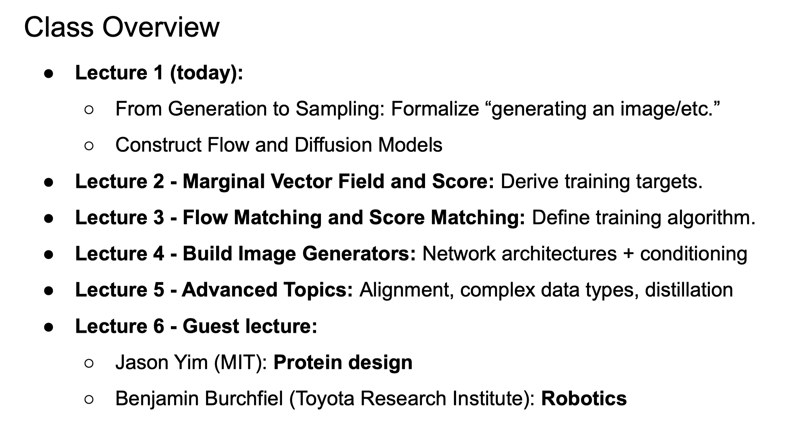
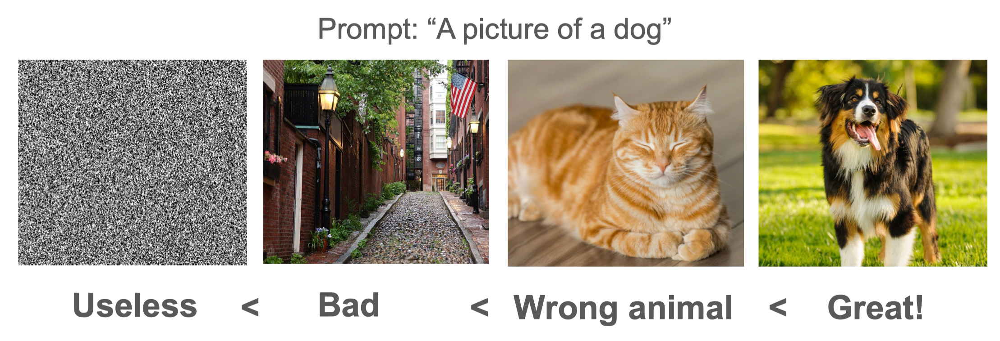
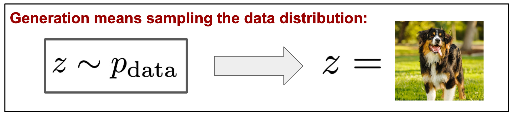
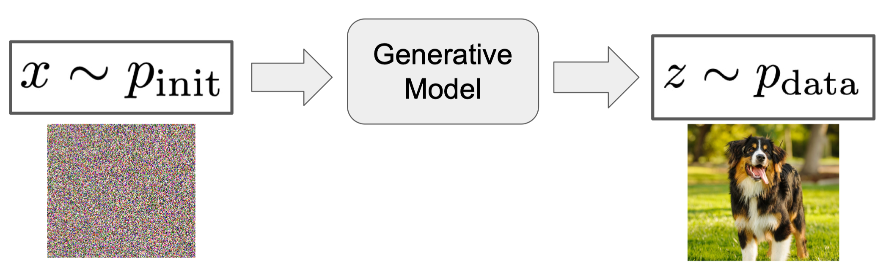
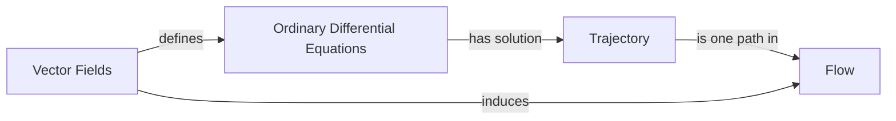
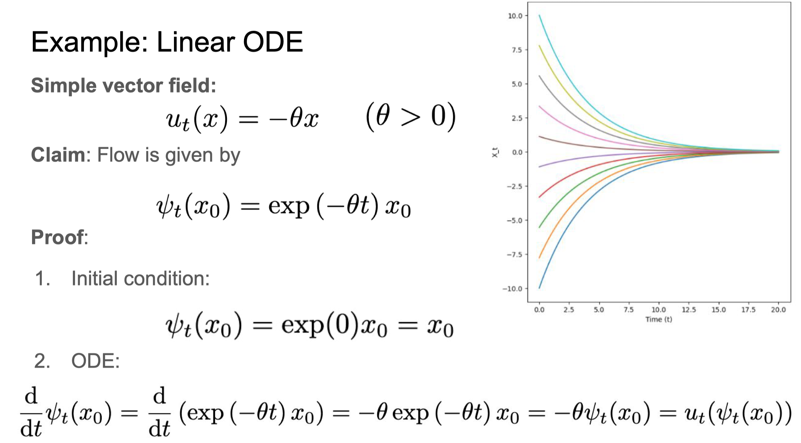
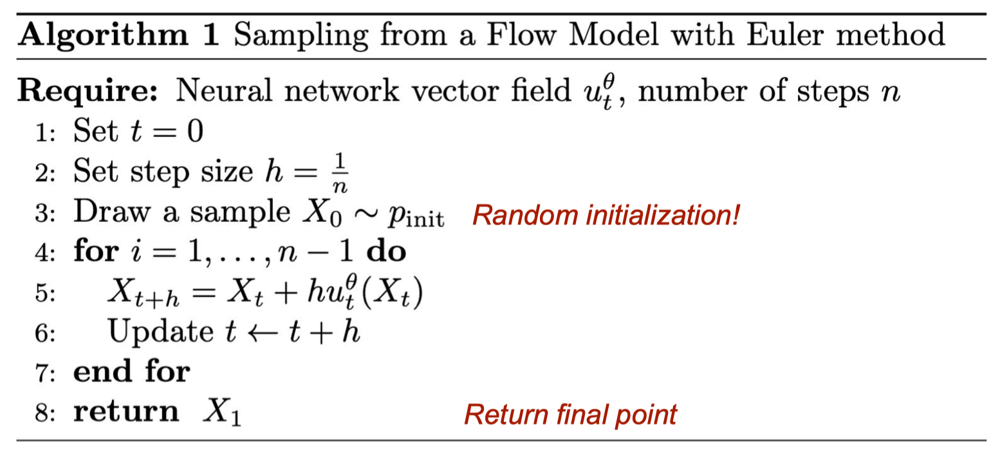
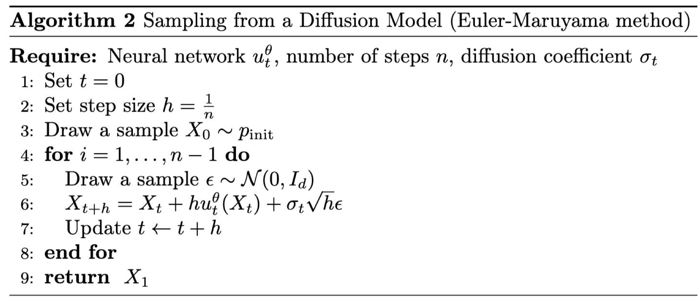
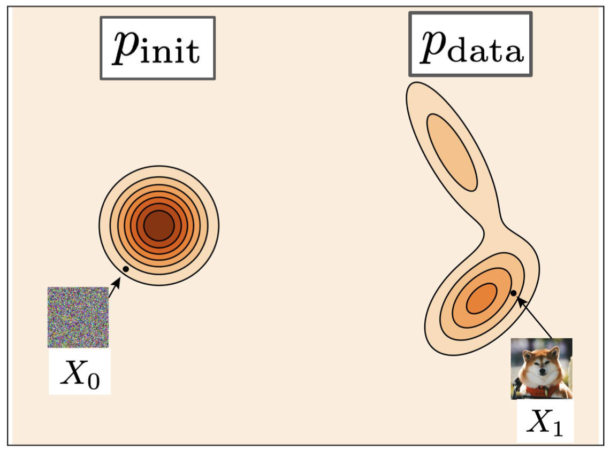

!!! abstract "Overview"
    - Video: [:fontawesome-solid-video: Lecture 01](https://www.youtube.com/watch?v=GCoP2w-Cqtg)
    - Slide: [:material-presentation: Lecture 01](https://diffusion.csail.mit.edu/docs/slides_lecture_1.pdf)
    - References:
        - [:octicons-cross-reference-16: Lecture notes](https://diffusion.csail.mit.edu/docs/lecture-notes.pdf#page=5.10)
        - [:octicons-cross-reference-16: Flow Matching Guide and Code by Meta](https://arxiv.org/pdf/2412.06264)
        - [:octicons-cross-reference-16: Diffusion Meets Flow Matching: Two Sides of the Same Coin](https://diffusionflow.github.io/)

## Course Overview
{width=90%}

## What is Generation

我们将想要生成的对象表示为向量： $z = \R^d$.

接下来，如何判断模型生成的结果是不是我们想要的呢，比如输入一个 prompt - *"A picture of a dog"*，模型可能会生成以下四个结果：

我们人类有认知的先验，对于这些生成结果可以很快地判断出它们的合理性和相关性。但是对于模型来说，并没有这样的先验知识，因此我们需要formalize这个过程，从而让模型学会判断生成结果的合理性。
最简单的做法就是用**概率(Probability)**来表示结果的好坏，概率越高的图像表明生成越合理，质量越好。

**How good an image is ~= How likely it is under the data distribution**

**生成(Genetation)**可以看作是从一个**数据分布(Data Distribution)** $p_\mathrm{data}$ 中**采样(Sampling)** $z$的过程。

一个训练用的数据集由来自数据分布的有限数量的样本组成：$\{z_1, z_2, \ldots, z_N\} \sim p_\mathrm{data}$.

**条件生成(Conditional Generation)**使我们能够基于提示进行条件化生成，在原先的数据分布上添加一个条件 $y$ 变成了一个新的条件数据分布，
我们可以将其表示为 $z \sim p_\mathrm{data}(\cdot|y)$.

**生成模型(Generative Model)**将来自初始分布 $p_\mathrm{init}$（如高斯分布）的样本转换为数据分布 $p_\mathrm{data}$ 中的样本：

## Flow and Diffusion Models

!!! tip "Our Target"

    在 Flow Model 和 Diffusion Model 中，我们不是通过训练网络直接建模数据分布 $p_\mathrm{data}$ 本身，而是通过训练一个 **“将噪声转化为数据”** 的模型来解决问题。
    这是我们的目标：我们选择建模一个向量场(Vector Field)，这个向量场能够将我们从可采样的简单噪声分布（如各向同性高斯分布）$p_\mathrm{init}$ 中抽取的样本 **“驱动(drive)”** 至目标数据分布 $p_\mathrm{data}$.

    后面会介绍，我们通过 **模拟(simulation)** 适当构建的微分方程，达到驱动所需要的 transformation， 这就是 Flow Matching 的核心思想。

### Flow Models

首先介绍一些概念：

- **轨迹(Trajectory)**：描述一个点 $x$ 随着时间 $t$ 在空间 $\R^d$ 中的运动 $t \rightarrow X_t$, **轨迹是一个函数**。
- **向量场(Vector Field)**：描述在给定时间 $t$ 和空间点 $x$ 时的速度，$\left(x, t\right) \rightarrow u_{t}(x)$.
- **Ordinary Differential Equation (ODE)**:
    - ODE 的含义：点 $X_t$ 的位置变化等于流场在点 $X_t$ 处的速度值
    - 形式化地说，ODE 可以表示为：

    $$
    \frac{\mathrm{d}}{\mathrm{d}t}X_t = u_{t}(X_t) \text{ with initial condition } X_0 = x_0
    $$

- **流(Flow)**: 表示在给定初始条件 $X_0 = x_0$ 下，上述 ODE 所有解的集合，$\left(X_0, t\right) \rightarrow \phi_t(x_0)$.

它们之间的关系是：

通过一个简单的例子来理解 Flow model:

{width=80%}

不同的初始条件 $x_0$ 会产生不同的轨迹 $X_t$，而这些轨迹构成的集合就是流 $F$.

当 ODE 没有 closed form 的解析解时，我们需要使用数值方法来近似求解，比如 **欧拉法(Euler Method)**：

{width=80%}

### Diffusion Models

在 Diffusion model 中，同样也有一些概念：

- **随机过程(Stochastic Process)**：随机的轨迹，其中的点 $X_t$ 随时间随机变化。
- **向量场(Vector Field)**：和 Flow model 一样。
- **扩散系数(Diffusion Coefficient)**：描述了随机过程的扩散程度，$t \sim \sigma_{t}, \  \sigma_{t} \geqslant 0$.
- **Stochastic Differential Equation (SDE)**:
    - 描述了点 $X_t$ 随时间 $t$ 的随机运动，其中每个时刻的运动速度由向量场 $u_t(x)$ 和扩散系数 $\sigma_{t}$ 决定。
    - SDE 可以表示为：ODE + 随机噪声(Stochastic Noise)，当 $\sigma_{t} = 0$ 时，SDE 就是 ODE，diffusion model 变成了 flow model.

    $$
    \mathrm{d} X_t = u_{t}(X_t)\mathrm{d} t + \sigma_{t}\mathrm{d} W_t \text{ with initial condition } X_0 = x_0
    $$

- **布朗运动(Brownian Motion)**：原指悬浮在介质中的粒子的随机运动，这里指随机噪声 $W_t \in \R^d$，它是一个随机过程，具有以下性质：
    - $W_0 = 0$
    - $W_t$ 是连续的
    - $W_t$ 的增量是独立的(Independent Increments)：
        - $W_{t+s} - W_s$ 和 $W_s$ 独立
    - $W_t$ 的增量服从正态分布(Gaussian Increments)：
        - $W_{t+s} - W_s \sim \mathcal{N}(0, t)$
    - 这个过程又叫做 **Wiener 过程(Wiener Process)**.

!!! note "Why use SDEs instead of ODEs?"
    因为我们真实世界充满了随机性，而 SDE 是一个随机过程，具有更强的表达能力，可以捕捉到数据分布中的随机性和不确定性。

我们可以将 SDE 从微分形式改写成：

$$
X_{t+h}=X_t+\underbrace{hu_t(X_t)}_{\text{deterministic}}+\sigma_t\underbrace{(W_{t+h}-W_t)}_{\text{stochastic}}+\underbrace{hR_t(h)}_{\mathrm{error~term}}
$$

- 其中的 $R_t(h)$ 是一个一阶小量（小于 $h$ 的高阶项），$\lim_{h \to 0} R_t(h) = 0$.
- 利用布朗运动的独立增量性质，我们将 $W_{t+h} - W_t$ 视为一个独立随机变量 $\epsilon_t \sim \mathcal{N}(0, hI_{d})$的函数。
- 省略误差项后，上面的表达式可以写成 $X_{t+h} = X_t + h u_{t}(X_t) + \sigma_{t} \sqrt{h} \epsilon_t$，这就是常见的 diffusion model 的形式。

!!! example "Example: Ornstein-Uhlenbeck(OU) Process"
    - 这是一个经典的 SDE，表达式为：

    $$
    \mathrm{d} X_t = - \theta X_t \mathrm{d}t + \sigma \mathrm{d} W_t
    $$

    - 线性偏移系数：$u_t(x) = -\theta x$.
    - 线性扩散系数：$\sigma_t = \sigma$.
    - 这个过程在 $t \to \infty$ 时收敛到一个高斯分布 $\mathcal{N}(0, \sigma^2)$.

和 Flow model 一样，我们利用神经网络来学习向量场 $u_{t}(X_t)$，并通过 SDE 来进行采样：

{width=80%}

我们可以用 diffusion model 做生成任务，将一个初始变量开始，逐步利用 SDE 采样，最后得到符合目标分布的样本：

1. Random init: $X_0 \sim p_\mathrm{init}$
2. Vector field (by a neural network): $u^{\theta}_{t}(x)$
3. Diffusion coefficient: $\sigma_{t}$
4. SDE: $\mathrm{d} X_t = u^{\theta}_{t}(X_t)\mathrm{d}t + \sigma_{t}\mathrm{d} W_t$
5. Goal: $X_T \sim p_\mathrm{data}$

{width=90%}

## Q&A
??? question "Why we choose Brownian motion as the stochastic process?"

    可以用其他的随机过程，比如 Levy 过程，但是 Brownian motion 是最简单的随机过程，具有一些很好的性质，比如增量的独立性和高斯分布，容易实现和计算。

??? question "Why flow matching might work better than other techniques(like GANs)?"

    *Google AI Overview:* 
    Flow matching can potentially be better than techniques like GANs due to its ability to provide exact likelihood estimates and a more stable training process, particularly when using diffusion paths.
    While GANs excel in sample quality, especially for image-based data, normalizing flows offer a clearer path to density estimation and variational inference. Flow matching also allows for more efficient training and sampling using non-diffusion paths like Optimal Transport.
