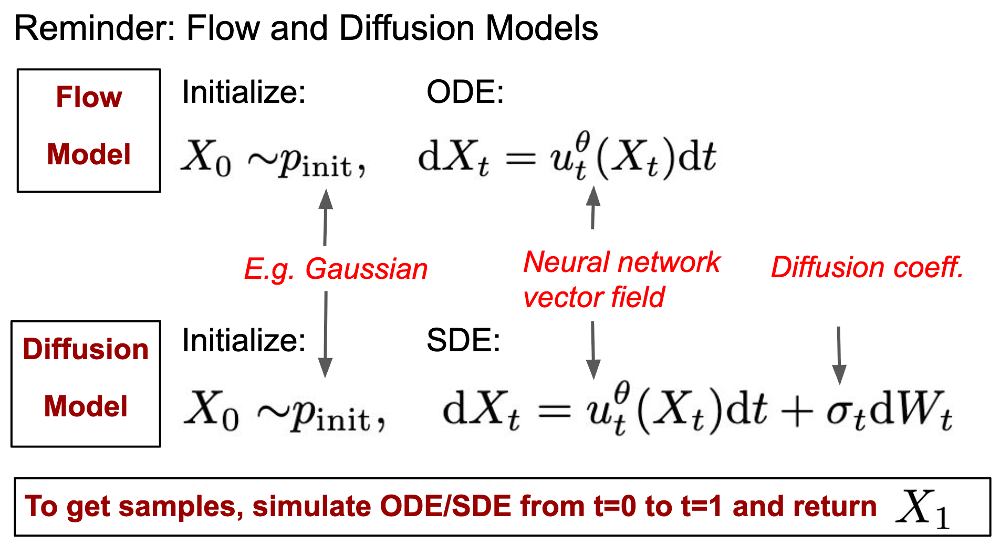
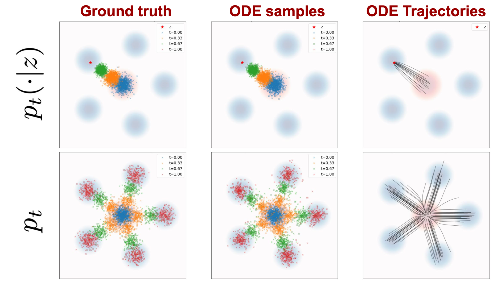
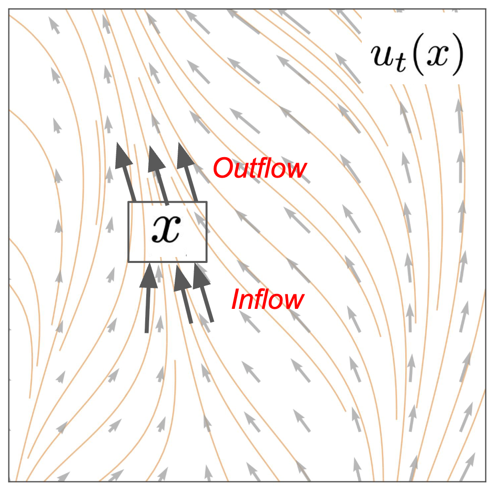
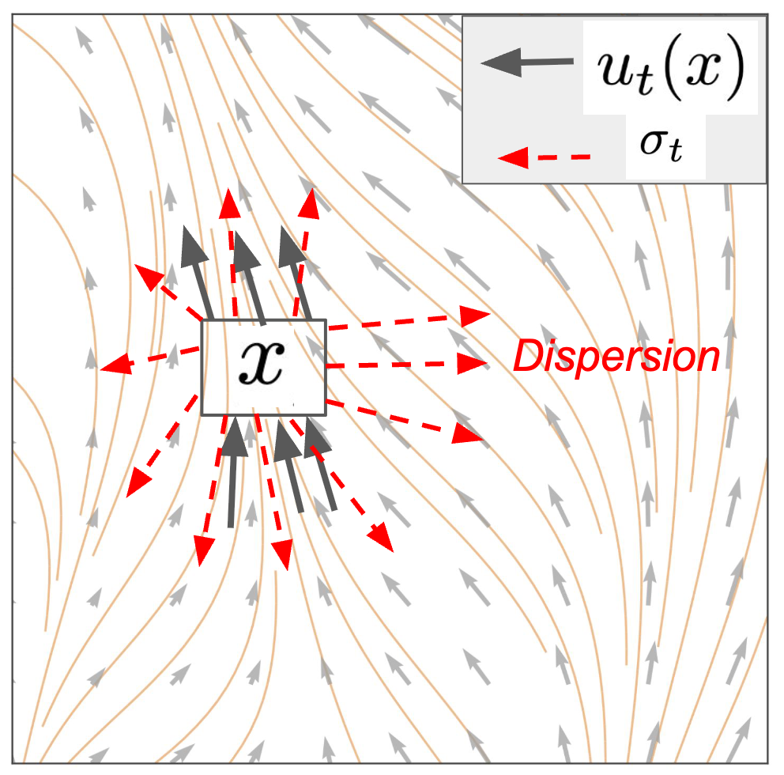

!!! abstract "Overview"
    - Video: [:fontawesome-solid-video: Lecture 02](https://www.youtube.com/watch?v=yFD-JSSG-D0)
    - Slide: [:material-presentation: Lecture 02](https://diffusion.csail.mit.edu/docs/slides_lecture_2.pdf)
    - References:
        - [:octicons-cross-reference-16: Lecture notes](https://diffusion.csail.mit.edu/docs/lecture-notes.pdf#page=12.10)
        - [:octicons-cross-reference-16: Flow Matching and Diffusion Deep Dive](https://medium.com/@hasfuraa/flow-matching-and-diffusion-deep-dive-b080f7782654)
        - [:octicons-cross-reference-16: Visualization Tool - DiffusionLab](https://alechelbling.com/DiffusionLab/)

## Recap

{width=90%}

## Training Target

构建了一个生成模型后，我们需要训练它从而使其能够生成合理的样本。
在上节课中，我们提到 flow/diffusion model 中只有 Vector Fields $u_t(X_t)$ 是用神经网络来学习的，因此我们的训练其实就是优化这个网络。
首先我们需要定义一个**训练目标(Training Target)**，最简单的做法是最小化均方误差(Mean Squared Error, MSE)，即最小化生成的矢量场和真实的矢量场之间的误差：

$$\boxed{L(\theta)=\|u_t^\theta(x)-u_t^{\mathrm{target}}(x)\|^2}$$

但是这个损失函数中的真实矢量场是未知的，我们能够得到的只有一些采样的真实样本 $x \sim p_{\mathrm{data}}$，
需要通过这些样本来 formulate $u_t^{\mathrm{target}}(x)$，这也是这一节课的重点: **How to formulate $u_t^{\mathrm{target}}(x)$?**

### Probability Path

我们知道在 $t = 0$ 和 $t = 1$ 时的数据分布是什么样的，但是在两者之间的时刻呢？为了回答这个问题，我们需要引入一个机制来描述 $t \in [0, 1]$ 中所有时间 $t$ 的插值分布。
概率路径为我们提供了一种数学方法，用以描述在从噪声到数据的转换过程中，每个时间点 $t$ 上预期观察到的插值分布。

!!! note "Conditional vs Marginal"

    - **Conditional**: Per single data point，考虑单点
    - **Marginal**: Across distribution of data points，让单点数据随机化，考虑分布，是我们最后想要的

**概率路径(Probability Path, PP)**: 从噪声分布到样本数据分布的插值路径

- **条件概率路径(Conditional Probability Path, CPP)**: $p_t(\cdot | z)$
    - interpolation between $p_{init}$ and a data point $z$
    - $p_t(\cdot | z)$ 是一个 $\R^d$ 上的分布
    - $p_0(\cdot | z) = p_{\mathrm{init}}, \quad p_1(\cdot | z) = \delta_z$，其中的 $\delta_z$ 是 Dirac delta function.

- **边际概率路径(Marginal Probability Pathm, MPP)**: $p_t(x)$
    - interpolation between $p_{init}$ and $p_{data}$
    - $z \sim p_{data}$，从单个样本变成了样本分布
    - $p_t(x) = \int p_t(x | z) p_{data}(z) dz$
    - $p_0(x) = p_{init}, \quad p_1(x) = p_{data}$

每一个 CPP 都可以推导出一个 MPP，这个过程叫做 **边际化(Marginalization)**，其实就是遍历所有的 $z$.

!!! example "Gaussian Probability Path"

    $p_t(\cdot | z) = \mathcal{N}(\alpha_t z, \beta_t^2 I_d), \quad \alpha_t = t, \beta_t = \sqrt{1-t}$

    $\alpha_t$ 和 $\beta_t$ 是 **"noise scheduler"** 函数，用于控制噪声的强度和数据分布的形状。

通过可视化理解概率路径：
{width=80%}

- 红色的范围表示初始分布，蓝色的范围表示数据分布
- 条件概率路径最后会收敛到一个点上，而边际概率路径则会收敛到一个分布上

### Conditional and Marginal Vector Fields

现在，我们已经掌握了描述从噪声到数据转化过程中每一步分布状态的方法，接下来我们需要有一个向量场，可以描述 $t$ 时刻与 $t + \epsilon$ 时刻之间**分布的增量**，从而逐步驱动分布从 $p_\mathrm{init}$ 到 $p_\mathrm{data}$.
这个向量场将是我们用来训练模型的最终目标。

我们先考虑更加简单的**条件向量场(Conditional Vector Field, CVF)**，如果向量场 $u_{t}^{\text{target}}(x | z)$ 满足：

- $X_0 \sim p_{init}$
- $\frac{\mathrm{d}}{\mathrm{d}t}X_t = u_{t}^{target}(X_t | z), z \sim p_\mathrm{data}$

那么，$X_t \sim p_{t}(\cdot | z)$，即每个时刻的分布都符合条件概率路径。

通过条件向量场 $u_{t}^{\text{target}}(x | z)$ 和边际概率路径 $p_t(x)$，我们可以得到**边际向量场(Marginal Vector Field, MVF)**的表达式为:

$$
u_{t}^{\text{target}}(x) = \int u_t^{\mathrm{target}}(x|z)\frac{p_t(x|z)p_{\mathrm{data}}(z)}{p_t(x)}\mathrm{d}z
$$

这里用到了贝叶斯公式，$p_t(x|z)$ 是条件概率路径，$p_{\mathrm{data}}(z)$ 是真实数据分布，$p_t(x)$ 是边际概率路径。

用这个条件向量场 $u_{t}^{\text{target}}(x | z)$，我们可以驱动 ODE：

$$
X_0 \sim p_{init}, \quad \frac{\mathrm{d}}{\mathrm{d}t} X_t = u_{t}^{\text{target}}(X_t)
$$

最后沿着边际概率路径 $p_t(x)$ 进行采样，得到 $X_1 \sim p_1(x) = p_{data}$.

### Continuity Equation

**连续性方程(Continuity Equation)**:  描述概率密度函数 $p_t(x)$ 随时间演化的偏微分方程

$$
\frac{\partial}{\partial t} p_t(x) = - div(p_t(x) u_t(x))
$$

左边表示 $p_t(x)$ 随时间的变化率，右边表示概率流 $p_t(x) \cdot u_t(x)$ 的**散度(divergence)**。

散度的定义： $div(v) = \nabla \cdot v = \displaystyle\sum_{i=1}^d \frac{\partial v_i}{\partial x_i}$

{width=70%}

!!! note "Continuity Equation"

    这个公式十分重要，是连接条件向量场和边际向量场的桥梁。只要条件向量场$u_t(x|z)$能生成对应的条件概率路径$p_t(x|z)$ (**满足连续性条件**), 则上述边际向量场$u_t(x)$能够生成对应的边际概率路径$p_t(x)$.

- **物理意义**：连续性方程描述了"概率质量守恒"，即概率密度的局部变化率等于流入/流出该区域的净概率流量。在 Flow model 中，它确保了从 $p_{init}$ 到 $p_{data}$ 的演化过程中概率总是守恒的。
- **直观理解**：想象概率密度像水流，散度为负表示水流汇聚（概率增加），散度为正表示水流发散（概率减少）。而向量场 $u_t$ 决定了概率"流动"的方向和速度。

### Score Function

在我们 formulate 了想要的 MVF 之后，我们还需要解决一个问题，就是 MVF 的 Tractability 并不好，一个直观的想法就是用数值法来近似，但这样意味着我们要遍历 $p_\mathrm{data}$ 中的每一个样本，这显然是不可行的。
我们可以通过**得分函数(Score Function)**来解决这个问题，它可以帮助我们在不需要遍历所有样本的情况下，近似计算 MVF.

**得分函数(Score Function)**: 对数似然梯度(log-likelihood gradient)

- 条件得分函数: $s_t(x|z) = \nabla_x \log p_t(x|z)$
- 边际得分函数: $s_t(x) = \nabla_x \log p_t(x)$

代入 $p_t(x)$，得到:

$$
s_t(x) = \nabla_x \log p_t(x) = \int \nabla_x log p_t(x|z) \frac{p_t(x|z)p_{\mathrm{data}}(z)}{p_t(x)}\mathrm{d}z
$$

!!! example "Gaussian Score Function"
    $s_t(x) = \nabla_x \log p_t(x | z) = - \frac{x - \alpha_t z}{\beta_t^2} = - \frac{1}{\beta_t^2} (x - \alpha_t z)$

### Fokker-Planck equation

**福克-普朗克方程(Fokker-Planck equation)** 是描述粒子在势能场中受到随机力后，随时间演化的位置或速度的分布函数。

$$
\large\frac{\partial}{\partial t}p_t(x)=\underbrace{-\mathrm{div}(p_tu_t)(x)}_{\text Continuity \ equ.} + \underbrace{\frac{\sigma_t^2}{2}\Delta p_t(x)}_{\text Heat \ equ.}
$$

{width=70%}

## Summary

{width=98%}

