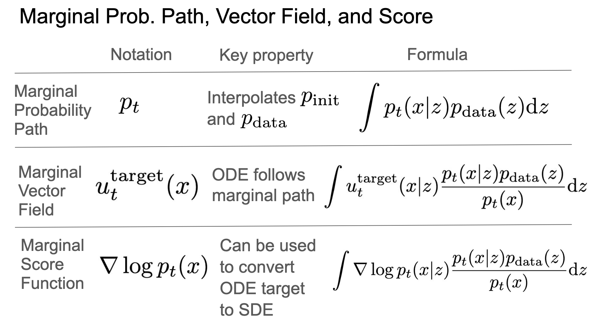

!!! abstract "Overview"
    - Video: [:fontawesome-solid-video: Lecture 03](https://www.youtube.com/watch?v=yFD-JSSG-D0)
    - Slide: [:material-presentation: Lecture 03](https://diffusion.csail.mit.edu/docs/slides_lecture_3.pdf)
    - References:
        - [:octicons-cross-reference-16: Lecture notes](https://diffusion.csail.mit.edu/docs/lecture-notes.pdf#page=23.10)
        - [:octicons-cross-reference-16: Flow Matching and Diffusion Deep Dive](https://medium.com/@hasfuraa/flow-matching-and-diffusion-deep-dive-b080f7782654)
        - [:octicons-cross-reference-16: Diffusion Meets Flow Matching: Two Sides of the Same Coin](https://diffusionflow.github.io/)

## Recap

=== "Conditional"

    {width=90%}

=== "Marginal"

    {width=90%}

## Flow Matching

我们的目标是 $u_t^{\theta} \approx u_t^{\mathrm{target}}$，我们需要定义一个训练目标来优化这个网络的参数 $\theta$.

### Flow Matching Loss

给定 $t \sim \mathcal{U}(0, 1), x \sim p_t(\cdot | z), z \sim p_{data}$

- $t$ 是一个均匀分布的随机变量，表示时间
- $z$ 是一个从数据分布中采样的样本
- $x$ 是一个从条件概率路径中采样的样本

$$\boxed{L_{\mathbf{FM}}(\theta) = \mathbb{E}_{t, x, z} \left[ \|u_t^{\theta}(x) - u_t^{\mathrm{target}}(x)\|^2 \right]}$$

在上节课中，我们提到这个损失函数是 intractable 的，而遍历所有的样本 $z$ 也是不现实的，但是有一个很关键的 insight:
**$L_{\mathbf{FM}}$ 和 $L_{\mathbf{CFM}}$ 只相差一个常数 $C$**，而且这个常数 $C$ 与训练参数 $\theta$ 无关，所以最小化后者同样可以达到训练目的。
证明过程在[课程笔记 Theorem 18](https://diffusion.csail.mit.edu/docs/lecture-notes.pdf#page=24.11) 中。

Conditional Flow Matching Loss:

$$\boxed{L_{\mathbf{CFM}}(\theta) = \mathbb{E}_{t, x, z} \left[ \|u_t^{\theta}(x) - u_t^{\mathrm{target}}(x | z)\|^2 \right]}$$

### Training Algorithm

{width=90%}

???+ example "Example: Gaussian CondOT Flow Matching"

    高斯条件概率路径和向量场:
    $u_t^{\mathrm{target}}(x | z) = \left(\dot{\alpha_t} - \frac{\dot{\beta_t}}{\beta_t} \right) z + \frac{\dot{\beta_t}}{\beta_t} x, x = \alpha_t z + \beta_t \epsilon, \epsilon \sim \mathcal{N}(0, I_d)$

    高斯条件流匹配损失函数:

    $$
    \begin{gathered}
    \mathcal{L}_{\mathrm{CFM}}(\theta)=\mathbb{E}_{t\sim\mathrm{Unif},z\sim p_{\mathrm{data}},x\sim\mathcal{N}(\alpha_tz,\beta_t^2I_d)}[\|u_t^\theta(x)-\left(\dot{\alpha}_t-\frac{\dot{\beta}_t}{\beta_t}\alpha_t\right)z-\frac{\dot{\beta}_t}{\beta_t}x\|^2] \\
    = \mathbb{E}_{t\sim\mathrm{Unif},z\sim p_\mathrm{data},\epsilon\sim\mathcal{N}(0,I_d)}[\|u_t^\theta(\alpha_tz+\beta_t\epsilon)-(\dot{\alpha}_tz+\dot{\beta}_t\epsilon)\|^2]
    \end{gathered}
    $$

    使用标准噪声规划器: $\alpha_t = t, \beta_t = 1-t$

    $$
    \mathcal{L}_{\mathrm{CFM}}(\theta)=\mathbb{E}_{t\sim\mathrm{Unif},z\sim p_\mathrm{data},\epsilon\sim\mathcal{N}(0,I_d)}[\|u_t^\theta(t \cdot z + (1-t) \cdot \epsilon)-(z - \epsilon)\|^2]
    $$

    <div class="grid" markdown>

    {width=120%}

    {width=70%}

    </div>

    :material-code-json: 训练的 PyTorch 代码:

    ```python
    t = torch.rand(batch_size) # 1. sample t from uniform distribution
    z = data_loader.sample(batch_size) # 2. sample z from data distribution
    e = torch.randn(batch_size) # 3. sample noise epsilon from standard normal distribution
    x = model(t * z + (1 - t) * e, t) # 4. get predicted values from our network u_t(x)
    target = z - e # 5. get target values
    loss = torch.mean((x - target) ** 2) # 6. compute loss
    loss.backward() # 7. backpropagate gradients
    optimizer.step() # 8. update parameters for our network u_t(x)
    ```

    > Meta MovieGen 和 Stable Diffusion 3 都用了这个训练算法。

## Score Matching

**边际得分函数(Marginal Score Function, MSF)** 允许将 ODE 扩展为具有任意扩散系数的 SDE.
不同于 Flow Matching，这里我们的网络 $s_t^{\theta}(x)$ 是近似一个目标得分函数(Score Function)，而不是一个向量场。


$$
\begin{aligned}
X_0\sim p_{\mathrm{init}},\quad\mathrm{d}X_t & =\left[u_t^{\mathrm{target}}(X_t)+\frac{\sigma_t^2}{2}\nabla\log p_t(X_t)\right]\mathrm{d}t+\sigma_t\mathrm{d}W_t \\
 & \Rightarrow X_t\sim p_t
\end{aligned}
$$

### Score Matching Loss

给定 $t \sim \mathcal{U}(0, 1), x \sim p_t(\cdot | z), z \sim p_{data}$

$$\boxed{L_{\mathbf{SM}}(\theta) = \mathbb{E}_{t, x, z} \left[ \|s_t^{\theta}(x) - \nabla_x \log p_t(x)\|^2 \right]}$$

Conditional Score Matching Loss:

$$\boxed{L_{\mathbf{DSM}}(\theta) = \mathbb{E}_{t, x, z} \left[ \|s_t^{\theta}(x) - \nabla_x \log p_t(x | z)\|^2 \right]}$$

在这里我们同样可以证明，$L_{\mathbf{SM}}$ 和 $L_{\mathbf{DSM}}$ 只相差一个常数，所以最小化后者同样可以达到训练目的。

### Training Algorithm

{width=90%}

??? example "Example: Denoising Score Matching for Gaussian Probability Path"

    以高斯分布为例：

    $$\nabla\log p_t(x|z)=-\frac{x-\alpha_tz}{\beta_t^2}, \epsilon\sim\mathcal{N}(0,I_d) \\ \Rightarrow x=\alpha_tz+\beta_t\epsilon\sim\mathcal{N}(\alpha_tz,\beta_t^2I_d)$$

    Denoising Score Matching Loss:

    $$\mathcal{L}_\mathrm{dsm}(\theta)= \mathbb{E}_{t\sim\mathrm{Unif},z\sim p_{\mathrm{data}},\epsilon\sim\mathcal{N}(0,I_{d})}[\|s_{t}^{\theta}(\alpha_{t}z+\beta_{t}\epsilon)+\frac{\epsilon}{\beta_{t}}\|^{2}]$$

    


现在，我们已经设计好了训练算法，训练后可以用 diffusion model 来生成样本了。
我们用一个 SDE 来描述随机采样的过程：

$$
\begin{aligned}
 & X_0\sim p_{\mathrm{init}},\quad\mathrm{d}X_t=\left[u_t^{\mathrm{target}}(X_t)+\frac{\sigma_t^2}{2}\nabla\log p_t(X_t)\right]\mathrm{d}t+\sigma_t\mathrm{d}W_t \\
 &
\Rightarrow X_t\sim p_t \\
 & X_0\sim p_{\mathrm{init}},\quad\mathrm{d}X_t=\left[u_t^\theta(X_t)+\frac{\sigma_t^2}{2}s_t^\theta(X_t)\right]\mathrm{d}t+\sigma_t\mathrm{d}W_t \\
 & \text{Affer training }\Rightarrow X_t\sim p_t
\end{aligned}
$$

Gaussian Probability Path:

$$
X_0 \sim p_{\mathrm{init}},\quad\mathrm{d}X_t=\left[\left(\beta_t^2\frac{\dot{\alpha}_t}{\alpha_t}-\dot{\beta}_t\beta_t+\frac{\sigma_t^2}{2}\right)s_t^\theta(x)+\frac{\dot{\alpha}_t}{\alpha_t}x\right]\mathrm{d}t+\sigma_t\mathrm{d}W_t
$$

## Denoising Diffusion Models

**去噪扩散模型(Denoising Diffusion Models, DDMs)** 是一种基于扩散模型的生成模型，我们一般直接把它叫做 diffusion model.
去噪扩散模型仅适用于高斯初始分布 $p_{\mathrm{init}} = \mathcal{N}(0, I_d)$ 和高斯概率路径。<br>
**Denoising Diffusion Models = Diffusion Models with Gaussian Probability Path**.

DDMs 有很多很好的性质，它的向量场和得分函数都是 $x$ 和 $z$ 的加权和，且是线性的，所以可以转换向量场和得分函数。

$$
u_t^{\mathrm{target}}(x|z)=\left(\dot{\alpha}_t-\frac{\dot{\beta}_t}{\beta_t}\alpha_t\right)z+\frac{\dot{\beta}_t}{\beta_t}x, \quad \nabla\log p_t(x|z)=-\frac{x-\alpha_tz}{\beta_t^2}
$$

还可以将得分函数的神经网络转换为向量场的神经网络后训练：$u_t^\theta=\left(\beta_t^2\frac{\dot{\alpha}_t}{\alpha_t}-\dot{\beta}_t\beta_t\right)s_t^\theta(x)+\frac{\dot{\alpha}_t}{\alpha_t}x$<br>
因此我们不需要训两个神经网络，最早的 diffusion model 只训练了一个得分函数的神经网络。
