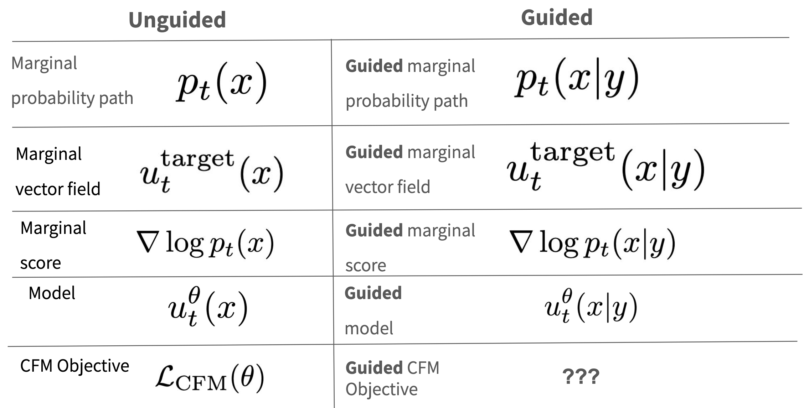
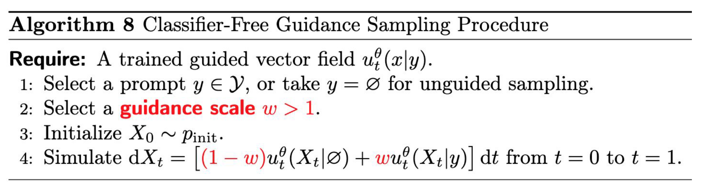
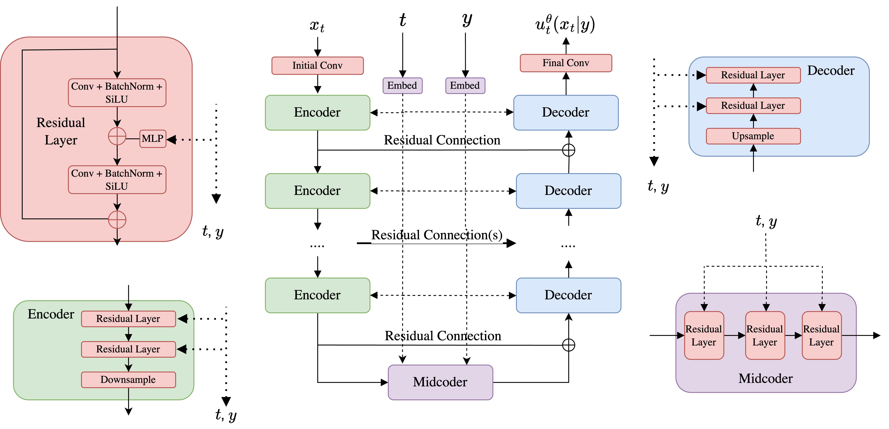
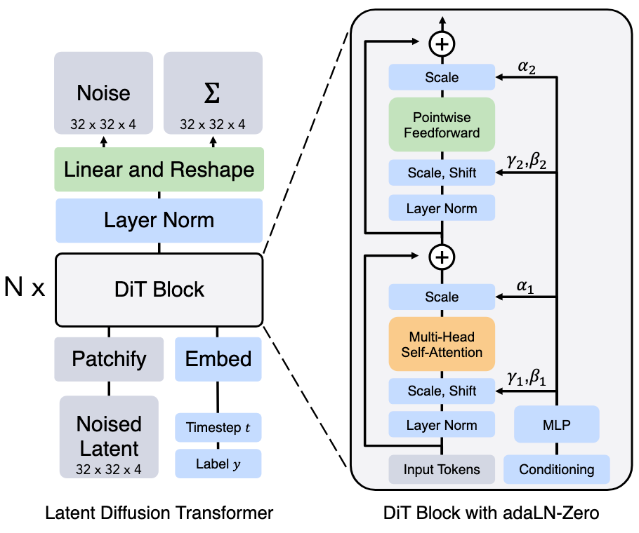
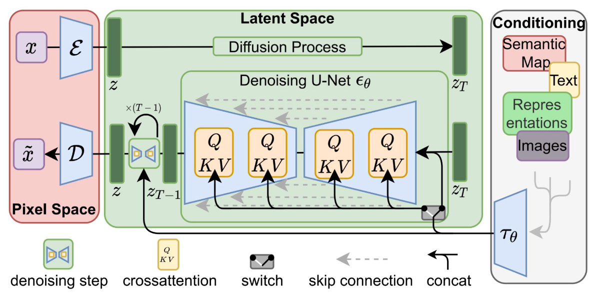

!!! abstract "Overview"
    - Video: [:fontawesome-solid-video: Lecture 04](https://www.youtube.com/watch?v=nfrZ30mnwP0)
    - Slide: [:material-presentation: Lecture 04](https://diffusion.csail.mit.edu/docs/slides_lecture_4.pdf)
    - References:
        - [:octicons-cross-reference-16: Lecture notes](https://diffusion.csail.mit.edu/docs/lecture-notes.pdf#page=36.11)

## Guidance and Conditional Generation

在之前的课中，我们介绍了如何训练一个无条件(unconditional) 的生成模型。而在实际应用中，我们往往需要生成一些有条件(conditional) 的样本，比如生成一些特定类别的图像，或者生成一些特定风格的图像。
接下来我们会引入 **Conditional Generation (Guidance)** 的概念，调整我们的训练目标来生成符合特定文本提示的图像。

无条件生成和有条件生成的区别：$y$ 是条件，比如文本(text prompts). 为了和之前的内容区分，我们统一术语用 **Guidance** 来表示。

<figure markdown="span">
    { width=80% align="center" }
</figure>

Guided generation 的目标是对于任意给定的 Guidance $y$，我们都能够从 $p_\mathrm{data}(x|y)$ 中采样样本。

我们需要 formulate **Guided CFM Objective** 来训练我们的条件生成模型:

$$
\begin{aligned}
\mathcal{L}_{\mathrm{CFM}}^{\mathrm{guided}}(\theta) & =\mathbb{E}_{\square}\|u_t^\theta(x|y)-u_t^{\mathrm{target}}(x|z)\|^2 \\
\square & =(z,y)\thicksim p_\mathrm{data}{(z,y)},t\thicksim\mathrm{Unif}[0,1),x\thicksim p_t(x|z)
\end{aligned}
$$

回想一下 unguided 的 CFM 训练目标，这两者的主要区别在于 guided CFM 会采样 $(z, y) \sim p_\mathrm{data}(z, y)$，数据分布变成了一个 joint 分布，之前是采样 $z \sim p_\mathrm{data}(z)$.

### Classifier-Free Guidance

对于高斯概率路径，通过转换公式，可以得到：

$$
\begin{aligned}
u_t^{\mathrm{target}}(x | y) & = a_t x + b_t \nabla_x \log p_t(x|y), \\
\mathrm{where}\quad (a_t, b_t) & = (\frac{\dot{\alpha_t}}{\alpha_t}, \frac{\dot{\alpha_t} \beta_t^2 - \dot{\beta_t} \beta_t \alpha_t}{\alpha_t})
\end{aligned}
$$

利用 Bayes'rule 可以得到：

$$
\begin{aligned}
\nabla_x \log p_t(x|y) & = \nabla_x \log \left( \frac{p_t(x)p_t(y|x)}{p_t(y)} \right) \\
& = \nabla_x \log p_t(x) + \nabla_x \log p_t(y|x) - \nabla_x \log p_t(y) \\
& = \nabla_x \log p_t(x) + \nabla_x \log p_t(y|x)
\end{aligned}
$$

代入到上面的式子中，可以得到：

$$
\begin{aligned}
u_t^{\mathrm{target}}(x | y) & = a_t x + b_t  \nabla_x \log p_t(x|y) \\
& = a_t x + b_t (\nabla_x \log p_t(x) + \nabla_x \log p_t(y|x)) \\
& = a_t x + b_t \nabla_x \log p_t(x) + b_t \nabla_x \log p_t(y|x) \\
& = u_t^{\mathrm{target}}(x) + b_t \nabla_x \log p_t(y|x)
\end{aligned}
$$

观察上面这个式子，我们会发现，$u_t^{\mathrm{target}}(x | y)$ 可以被分解为两部分：

- 第一项是 unguided vector field, 和 guidance $y$ 无关。
- 第二项是 guided score，和引入的 guidance 有关。

一个很自然的想法是通过增强第二项的强度，来控制模型生成符合 guidance $y$ 的样本。
于是，我们将 $\log p_t(x|y)$ 称为 **Classifier**，同时引入一个 **Guidance Scale** $w \geq 1$ 来表示 guidance 的强度。

$$
\tilde{u}_t(x|y) = u_t^{\mathrm{target}}(x) + w b_t \nabla_x \log p_t(y|x)
$$

这个过程被称为 **Classifier Guidance(CG)**.

将上面这个式子改写成另一种形式：

$$
\begin{aligned}
\tilde{u}_t(x|y) & = u_t^{\mathrm{target}}(x) + w b_t \nabla_x \log p_t(y|x) \\
& = u_t^{\mathrm{target}}(x) + w b_t \left( \nabla_x \log p_t(x|y) - \nabla_x \log p_t(x) \right) \\
& = u_t^{\mathrm{target}}(x) - (w a_t x + w b_t \nabla_x \log p_t(x)) + (w a_t x + w b_t \nabla_x \log p_t(x|y)) \\
& = (1 - w) u_t^{\mathrm{target}}(x) + w u_t^{\mathrm{target}}(x|y)
\end{aligned}
$$

这个过程被称为 **Classifier-Free Guidance(CFG)**. 在 CFG 中，我们不需要单独训练一个 classifier.

### CFG Training and Sampling

**CFG Training:**

经过 CFG 的变换，我们发现目标 $\tilde{u}_t(x|y)$ 是 unguided/guided vector field 的线性组合。可以在训练好 unguided/guided vector field 后，在 inference 阶段，通过线性组合得到 $\tilde{u}_t(x|y)$.

另一个发现是 unguided vector field $u_t^{\mathrm{target}}(x)$ 其实是 condition on $\varnothing$ 的一个特例。这意味着我们只需要在训练的过程中随机设置 $y=\varnothing$，就可以同时训练 unguided 和 guided vector field.

**CFG Conditional Flow Matching:**

$$
\begin{aligned}
\mathcal{L}_{\mathrm{CFM}}^{\mathrm{CFG}}(\theta) & =\mathbb{E}_\square\|u_t^\theta(x|y)-u_t^{\mathrm{target}}(x|z)\|^2 \\
\square & =(z,y)\thicksim p_{\mathrm{data}}(z,y),\text{ with prob. }\eta,y\leftarrow\varnothing,t\thicksim\mathrm{Unif}[0,1),x\thicksim p_t(x|z)
\end{aligned}
$$

**Sampling Algorithm:**

训练好 $\tilde{u}_t^\theta(x|y)$ 后，给定一个 guidance(e.g. text prompt) $y$，我们可以通过以下算法采样得到样本：

<figure markdown="span">
    { width=90% align="center" }
</figure>

!!! tip "Distribution of $X_1$"

    - 当 $w = 1$ 时，$X_1$ 的分布是 $p_\mathrm{data}(\cdot|y)$.
    - 当 $w > 1$ 时，$X_1$ 的分布是 $p_\mathrm{data}(\cdot|y)$ 和 $p_\mathrm{data}(\cdot)$ 的混合分布。

### Guidance for Diffusion Models

和 CFM 类似，CFG Score $\tilde{s}_t(x|y) = (1 - w) \nabla_x \log p_t(x | \varnothing) + w \nabla_x \log p_t(x|y)$.

**CFG Denoising Score Matching:**

$$
\begin{aligned}
\mathcal{L}_{\mathrm{DSM}}^{\mathrm{CFG}}(\theta) & =  \mathbb{E}_{\square}\|s_t^\theta(x|y)-\nabla\log p_t(x|z)\|^2 \\
\square & = (z,y)\sim p_{\mathrm{data}}(z,y),t\sim\mathrm{Unif}[0,1),\mathrm{~}x\sim p_t(\cdot|z),\mathrm{~replace~}y=\varnothing\text{ with prob. }\eta,
\end{aligned}
$$

**Sampling Algorithm:**

$$
\begin{aligned}
 & \text{Initialization:}\quad X_0\sim p_{\mathrm{init}}(x) \\
 & \text{Simulation:}\quad\mathrm{d}X_t= \left[ \tilde{u}_t^\theta(X_t|y) + \frac{\sigma_t^2}{2} \tilde{s}_t^\theta(X_t|y) \right] \mathrm{d}t + \sigma_t \mathrm{d}W_t \\
 & \mathrm{Samples:}\quad X_1
\end{aligned}
$$

## Neural Network Architectures

接下来我们将讨论用于 flow/diffusion model 的神经网络架构设计，即如何构建一个神经网络来表示 $u_t^{\theta}(x|y)$ 和 $s_t^{\theta}(x|y)$. 网络的输入输出如下：

- 输入: vector $x \in \R^d$, conditional variable $y \in \mathcal{Y}$, time $t \in [0,1]$.
- 输出: vector $u_t^{\theta}(x|y) \in \R^d$ 或 score $s_t^{\theta}(x|y) \in \R^d$.

需要关注的点：How is $y$ **encoded**, **embedded**, and **processed**?

### U-Nets

<figure markdown="span">
    { width="90%" align="center" }
    <figcaption>The simplified U-Net architecture </figcaption>
</figure>

- U-Net 的关键特征是其输入和输出都具有图像的形状 (可能具有不同的通道数)，并且具有**残差连接(residual connection)**，可以捕捉到不同尺度的特征。
- U-Net 由一系列编码器(Encoder)和相应的解码器序列(Decoder)以及中间编码器(Midcoder)组成。
- 各个模块的维度 (以 256x256 的图像为例)：
    - $x_t^{\mathrm{input}} \in \R^{3 \times 256 \times 256}$
    - $x_t^{\mathrm{latent}} = \mathrm{Encoder}(x_t^{\mathrm{input}}) \in \R^{512 \times 32 \times 32}$, 通道数会逐渐增加，图像分辨率会逐渐减小。
    - $x_t^{\mathrm{latent}} = \mathrm{Midcoder}(x_t^{\mathrm{latent}}) \in \R^{512 \times 32 \times 32}$
    - $x_t^{\mathrm{output}} = \mathrm{Decoder}(x_t^{\mathrm{latent}}) \in \R^{3 \times 256 \times 256}$
- 这里展示的是课程中使用的简化 U-Net 架构，只有卷积层，事实上很多架构都会用 attention layer 代替卷积层。

### Diffusion Transformers

<figure markdown="span">
    { width="60%" align="center" }
    <figcaption>Credit: Scalable Diffusion Models with Transformers</figcaption>
</figure>

- DiT 的核心思想本质上是将图像分割成块(patches)，embed 每个块，然后在块之间进行 attention.

### Latent Diffusion Models

<figure markdown="span">
    { width="80%" align="center" }
    <figcaption>Credit: High Resolution Image Synthesis with Latent Diffusion Models</figcaption>
</figure>

- LDM 的核心思想是训练一个在**隐空间(latent space)**的扩散模型，然后通过 VAE 将隐空间映射回原始空间。这样的好处是可以降低内存，可以生成高分辨率图像。

## Q&A

??? question "What's the difference between classifier guidance and classifier-free guidance?"

    - CG 需要单独训练一个 classifier，而 CFG 不需要。因此 CG 只能用分类模型控制生成的类别，生成的类别数有限，而 CFG 可以生成任何条件下的样本。
    - CG 不需要重新训练 diffusion model, 而 CFG 需要重新训练 diffusion model.

??? question "Classifier-free Guidance destroys the quasi-linear properties of Neural Diffusion Operator?"

    摘录自空门大佬的知乎：[Classifer-free Guidance 是万恶之源](https://zhuanlan.zhihu.com/p/588808879)
