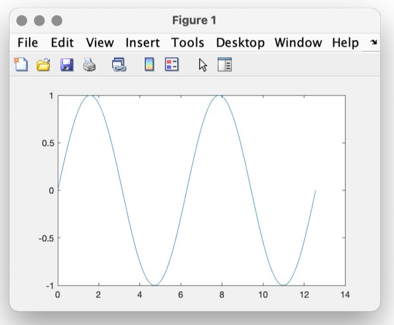
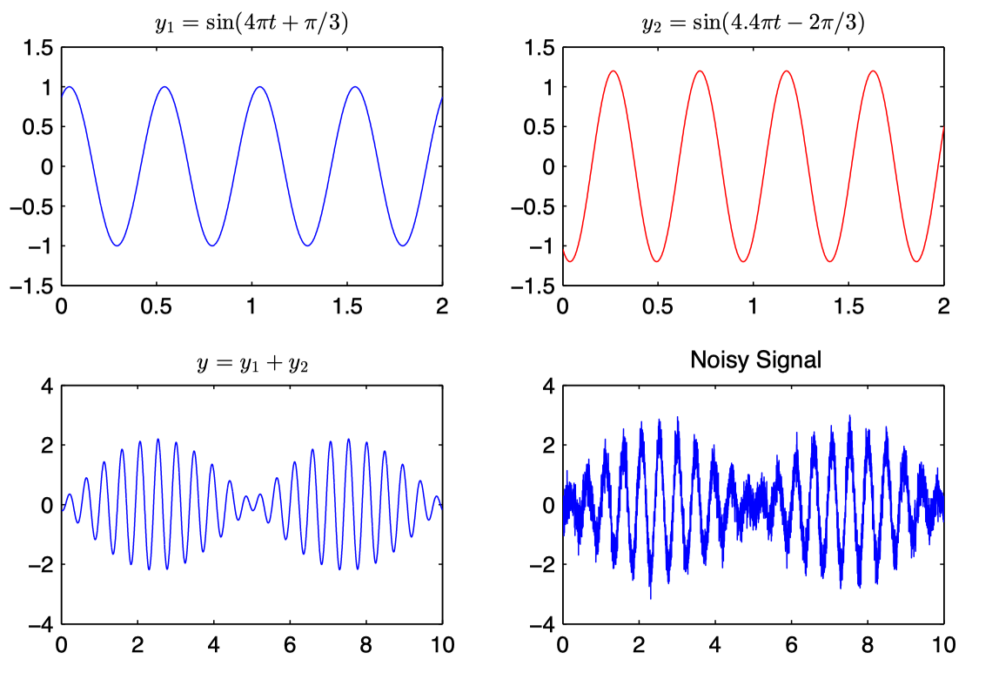

# MATLAB

!!! abstract "Abstract"
    信号课的时候正好需要用到 MATLAB，在这里记一些内容<br>

    官方文档：

    - [English](https://www.mathworks.com/help/matlab/)
    - [Cninese](https://ww2.mathworks.cn/help/matlab/)

## 基础语法

MATLAB 用 `%` 来表示注释

## 数据对象

## 流程控制

### if 语句

```matlab
if expression1
  statements1
elseif expression2
  statements2
else
  statements3
end
```

### while 语句

```matlab
while expression
  statements
end
```

### for 语句

```matlab
for index = initval:step:endval
  statements
end
```

## 绘图

### plot 函数

`plot` 函数是绘制二维曲线的函数

```matlab
x = linspace(0,4*pi,300);
y = sin(x);
plot(x,y);
```

<figure markdown>
{width="450"}
<figcaption></figcaption>
</figure>

如果要在同一图中画出多条曲线，只需将坐标依次放入 `plot` 函数即可，并且可以改变每条曲线的颜色、线型等

```matlab
plot(x,sin(x),'c',x,cos(x),'r:');
```

我们还可以给图片加上标注、图注、标题

```matlab
xlabel('x'); ylabel('y');
legend('sin(x)','cos(x)');
title('Sine and Cosine Functions');
```

> title、legend、label 都是支持 $LaTeX$ 语法的

  ```matlab
  title('$y_1=\sin(4\pi t+\pi /3)$','interpreter','latex')
  ```

还可设定合适的坐标轴范围

```matlab
axis([0 4*pi -1.2 1.2]);
```

<figure markdown>
{width="450"}
<figcaption></figcaption>
</figure>

如果要在一个绘图窗口中绘制多个图形，可以使用 `subplot(m,n,p)` 命令，其 中参数 m 和 n 给定在一个窗口中显示 m 行 n 列个图形，p 表示选定第 p 个图形区域，即在第 p 个区域作图

```matlab
t = linspace(0,10,5001);
A1 = 1.; w1 = 2*pi*2; p1=pi/3;
A2 = 1.2; w2 = 2*pi*2.2; p2=-2*pi/3;
snr = 10; %Signal-to-noise ratio in dB.
y1 = A1*sin(w1*t+p1);
y2 = A2*sin(w2*t+p2);
y = y1+y2;
yn = awgn(y,snr,'measured'); % Add white Gaussian noise.

subplot(2,2,1); plot(t,y1); axis([0,2,-1.5,1.5]);
title('$y_1=\sin(4\pi t+\pi /3)$','interpreter','latex')

subplot(2,2,2); plot(t,y2,'red'); axis([0,2,-1.5,1.5]);
title('$y_2=\sin(4.4\pi t-2\pi /3)$','interpreter','latex')

subplot(2,2,3); plot(t,y);
title('$y=y_1+y_2$','interpreter','latex');

subplot(2,2,4); plot(t,yn);
title('Noisy Signal');
```

<figure markdown>
{width="450"}
<figcaption></figcaption>
</figure>

### stem 函数

`stem` 函数可以画出杆状图来显示离散时间信号

`clear` 函数可以清除当前工作区所有变量，`clf` 函数可以清空当前图窗

```matlab
clear;
k1 = -3; k2 = 6; k = k1:k2;
axisscaling=[k1,k2,-.1,1.1];
n = 0;
x = +(k==n); %impulse series
x1 = +(k>=n); %step series

subplot(1,2,1);
stem(k,x,'filled');
title('Discrete Impulse Function')
axis(axisscaling); xlabel('$n$','interpreter','latex');
ylabel('$\delta[n]$','interpreter','latex');

subplot(1,2,2);
stem(k,x1,'filled');
title('Discrete Step Function')
axis(axisscaling); xlabel('$n$','interpreter','latex');
ylabel('$u\left[n\right]$','interpreter','latex');
```
